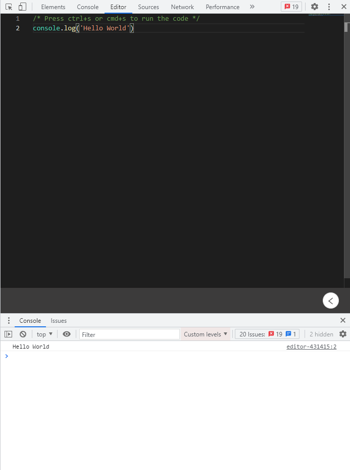

# TypeScript Editor

An extension used in Google Chrome, can let you write down TypeScript or JavaScript code in Devtools Panel, and show output in Console Panel.

## Usage

**Mac**: press `cmd+s`  to run the code.

**Win**: press `ctrl+s` to run the code.

